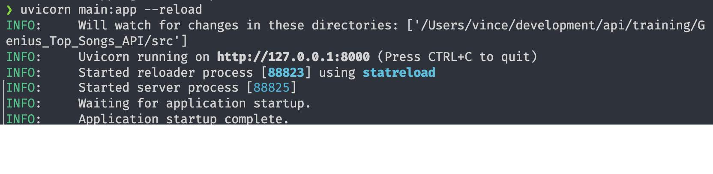

# Genius-Top-Songs-API
an API to get the top songs listed on genius.com


## Setup
### Virtual Environment
```
python3 -m venv venv
source venv/bin/activate
```
Or use any virtual environment you like.

### Uvicorn
To show the UI I used in the Introduction, we use uvicorn.
You do this as such:
```
uvicorn main:app --reload
```
It should know look like this in your terminal and a browser Window with the API UI should show up.

